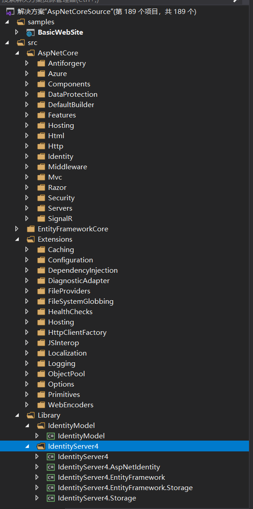

## 说明

本仓储整合了ASP.NET Core相关的所有源码，可以方便的进行源码阅读、调试~

运行本项目需要安装.Net Core 3.0版本，解决方案非常大，总共包含190+项目，电脑配置低或者安装有resharper插件的用户请慎重点开~

## 启动方式

打开命令行，进入`samples\BasicWebSite`目录，执行命令 `dotnet watch run`，访问 `http://localhost:6220/`可看到天气信息~

## 版本说明

> .Net Core：3.0

> EFCore：3.0

> IdentityServer4：3.0.1

## 项目结构预览图

